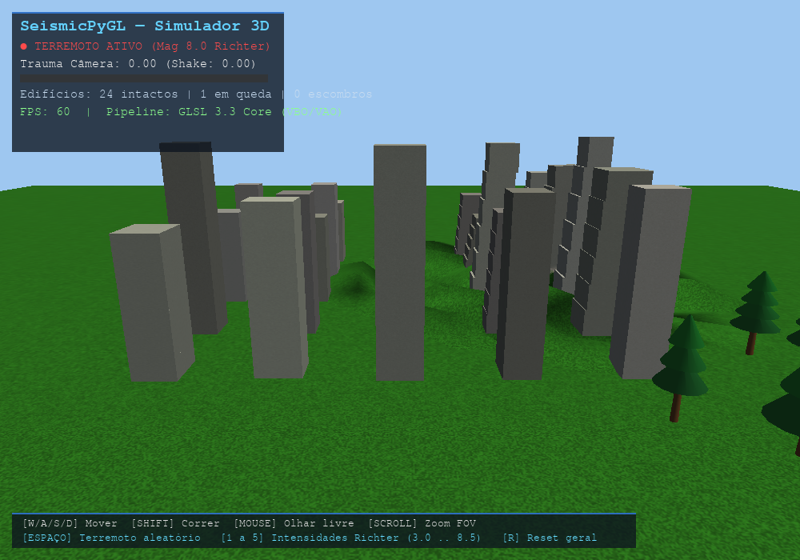

# SeismicPyGL 3D — Simulador de Terremotos (PyOpenGL + Pygame)

Simulador 3D de terremotos de alto desempenho em Python com **Pygame + PyOpenGL**, utilizando **pipeline programável moderno (GLSL 3.3 Core)**, buffers VBO/VAO, câmera com screen shake por trauma amortecido por Ruído de Perlin, deformação de terreno por onda senoidal diretamente na GPU, modelo físico de colapso de edifícios, partículas de poeira e fumaça com billboarding esférico e alpha blending, e HUD 2D com isolamento de profundidade.



---

## 🎮 Controles Interativos

| Tecla / Ação | Função |
| :--- | :--- |
| `W` | Anda para frente na direção da visão |
| `A` | Anda para a esquerda |
| `D` | Anda para a direita |
| `S` | Anda para trás (a câmera permanece na altura do chão) |
| `SHIFT` | Corrida rápida (sprint) |
| `MOUSE` | Olha ao redor com sensibilidade controlada (limite vertical para evitar inversão) |
| `SCROLL` | Zoom na câmera (FOV dinâmico) |
| `ESPAÇO` | Dispara terremoto de magnitude intermediária (5.5 Richter) |
| `1` a `5` | Dispara terremotos em intensidades calibradas (3.0 a 8.5 na Escala Richter) |
| `R` | Reseta a cidade, remove destroços e restaura a câmera inicial |
| `ESC` | Fecha o simulador com liberação segura de recursos |

---

## 🛠️ Tecnologias e Arquitetura

- **Pipeline Programável Moderno (GLSL 3.3 Core):** Sem `glBegin/glEnd` ou matrizes de função fixa legadas.
- **Deformação de Terreno na GPU (`ground.vert`):** A equação de onda radial senoidal e o recálculo analítico dos vetores normais são executados inteiramente nos núcleos da GPU.
- **Screen Shake por Trauma (`camera.py` + `math_utils.py`):** Modelo de trauma $[0.0, 1.0]$ com queda cúbica ($Trauma^3$) e amostragem de Ruído de Perlin para dessincronizar Pitch, Yaw, Roll e Translação.
- **Colapso Estrutural com Efeito Chicote (`scene.py`):** Edifícios fatiados que acumulam dano mecânico, sofrem inclinação progressiva e afundamento na base no eixo Y ($M = T \times R \times S$).
- **Sistema de Partículas (`particles.py`):** Billboarding esférico extraído da View Matrix com textura em gradiente radial suave e `glBlendFunc(GL_SRC_ALPHA, GL_ONE_MINUS_SRC_ALPHA)`.
- **HUD 2D Ortográfico (`hud.py`):** Exibe métricas em tempo real (Escala Richter, trauma da câmera, contador de prédios e FPS) com isolamento total do buffer de profundidade (`glDisable(GL_DEPTH_TEST)`).

---

## 📦 Como Instalar e Executar

### 1. Criar ambiente virtual (recomendado)

```bash
python3 -m venv .venv
source .venv/bin/activate   # Linux/macOS
# .venv\Scripts\activate    # Windows
```

### 2. Instalar dependências

```bash
pip install -r requirements.txt
```

### 3. Pré-processamento das texturas PBR (conversão EXR -> PNG 2K)

Antes de rodar pela primeira vez com os pacotes PBR, execute o conversor otimizado de EXR para PNG:

```bash
python tools/convert_exr_textures.py
```
*(Para manter resolução 4K máxima sem redimensionamento para 2048x2048, use a flag `--full-4k`)*

### 4. Executar o simulador

O jogo detecta e ativa automaticamente a placa de vídeo dedicada (NVIDIA RTX) no Linux/WSL:

```bash
python main.py
```

---

## 📁 Estrutura do Projeto

```
SeismicPyGL/
├── main.py                     # Loop de eventos, orquestração e render pass
├── camera.py                   # FreeCamera com Euler angles + Trauma/Perlin Screen Shake
├── math_utils.py               # Matrizes 4x4 (MVP), vetores e Perlin Noise 1D/2D puro
├── shader.py                   # Gerenciador e compilador de Programas GLSL
├── mesh.py                     # Gerenciador de VBO / VAO com dados entrelaçados
├── obj_loader.py               # Leitor Wavefront .obj e geradores procedurais
├── texture.py                  # Loader de texturas via PIL e geradores procedurais
├── earthquake.py               # Física sísmica, propagação de ondas e parâmetros Richter
├── scene.py                    # Entidades da cena: Ground, Building, Mountain, Tree
├── particles.py                # Sistema de partículas com Billboards & Alpha Blending
├── hud.py                      # Interface 2D com Pygame Font e projeção ortográfica
├── assets/
│   ├── shaders/
│   │   ├── scene.vert / scene.frag          # Iluminação Phong + Texturas
│   │   ├── ground.vert / ground.frag        # Deformação da onda sísmica na GPU
│   │   ├── billboard.vert / billboard.frag  # Partículas de fumaça e poeira
│   │   └── hud.vert / hud.frag              # Projeção ortográfica 2D
│   ├── textures/                            # Texturas de concreto, grama e fumaça
│   └── models/                              # Modelos 3D .obj
├── requirements.txt            # Dependências fixadas
├── STATUS_ISSUES.md            # Auditoria de 22/22 requisitos concluídos
└── README.md
```
